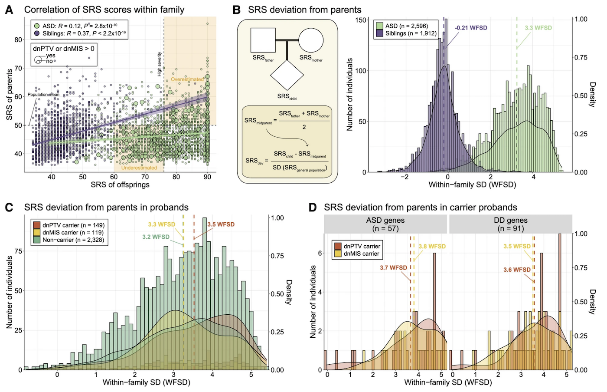

# 3장. Figure 작성하기 — 시각화로 생각하기

논문을 쓸 때 가장 먼저 해야 할 일은 무엇일까? Introduction을 쓰는 것? 방법론을 정리하는 것? 아니다. **Figure를 그리는 것**이다.

데이터 분석 결과가 나오면, 그 즉시 시각화해야 한다. 완벽한 결과를 기다릴 필요가 없다. 오히려 완벽하지 않은 상태에서 Figure를 그려보는 것이 논문 작성의 핵심이다. Figure를 그리는 과정은 단순히 '그림을 만드는 것'이 아니라, **논문의 구조를 설계하고, 논리를 점검하고, 부족한 부분을 발견하는 과정**이다.

많은 학생들이 "결과가 완벽해지면 그때 Figure를 그리겠다"고 생각한다. 하지만 이것은 논문 쓰기를 10배 더 어렵게 만드는 접근이다. Figure는 논문의 골격이다. 골격 없이 살을 붙이려고 하면, 결국 무너진다.

---

## Figure는 논문의 설계도다

Figure를 먼저 그리면, 논문의 전체 구조가 눈에 보인다. Figure 1부터 Figure 5까지 대략적인 흐름을 스케치해보자. 각 Figure가 어떤 질문에 답하고, 어떤 데이터를 보여줄지 정하는 것이다.

이 단계에서 모든 패널이 완성될 필요는 없다. 어떤 패널은 "아직 분석 중"이어도 괜찮다. 중요한 것은 **Figure의 전체 구조를 먼저 잡는 것**이다.

예를 들어, 자폐스펙트럼장애(ASD) 유전학 연구를 한다고 가정해보자 ([Kim et al. 2025, Genome Medicine](https://pmc.ncbi.nlm.nih.gov/articles/PMC12366145/)). 논문의 핵심 질문이 "de novo variant가 ASD 표현형에 미치는 영향은 가족 내 유전적 배경을 고려했을 때 어떻게 달라지는가?"라면, Figure 구성은 다음과 같이 설계할 수 있다:

- **Figure 1**: 가족 내 표현형 편차(WFSD)의 개념과 측정 방법
- **Figure 2**: WFSD를 사용한 유전자 발견 및 pathway 분석
- **Figure 3**: De novo variant의 신경발달 프로파일에 대한 효과 크기
- **Figure 4**: 가족 간 표현형 가변성이 큰 유전자 발굴

이렇게 Figure의 골격을 먼저 세우면, 논문의 논리가 명확해진다. 각 Figure가 하나의 주장을 담고, 그 주장들이 순서대로 연결되어 전체 스토리를 구성한다.

---

## 얼개부터 그려라: 초안 Figure의 힘

처음 논문을 쓰는 학생들이 가장 많이 하는 실수는 **완벽한 결과가 나올 때까지 Figure를 그리지 않는 것**이다. "이 분석이 끝나면", "저 데이터가 추가되면" 하면서 Figure 작성을 미룬다. 그러다 보면 논문 쓰기 자체가 막막해진다.

Figure는 **얼개(scaffold)**부터 그려야 한다. 모든 패널이 완성되지 않아도 괜찮다. 빈 공간에 "Panel C: 분석 진행 중"이라고 적어두고, 나머지 패널부터 채워나가면 된다.

초안 Figure를 만드는 순간, 놀라운 일이 일어난다:
- 어떤 결과가 부족한지 즉시 보인다
- 패널 간 논리적 연결이 자연스러운지 점검할 수 있다
- 지도교수나 공동저자와 논의할 구체적인 자료가 생긴다

예를 들어, Figure 1의 초안을 그릴 때 Panel A (부모-자녀 SRS 상관관계), Panel B (WFSD 계산 방법)는 이미 완성했지만, Panel C와 D는 아직 분석 중일 수 있다. 그래도 괜찮다. 빈 패널에 placeholder를 넣어두고 전체 구조를 먼저 확인하는 것이 중요하다.

```r
library(ggplot2)
library(cowplot)

# Panel A: 완성된 plot
pA <- ggplot(family_data, aes(parent_SRS, child_SRS, color = group)) +
  geom_point() +
  theme_bw() +
  labs(title = "A. Correlation of SRS scores within family")

# Panel B: 완성된 schematic
pB <- ggplot() + 
  theme_void() +
  annotate("text", x = 0.5, y = 0.5, label = "B. WFSD calculation", size = 5)

# Panel C와 D: Placeholder (아직 분석 중)
placeholder_C <- ggplot() +
  theme_void() +
  annotate("text", x = 0.5, y = 0.5, 
           label = "C. SRS deviation by genetic subgroup\n(분석 진행 중)", 
           size = 4, color = "grey60")

placeholder_D <- ggplot() +
  theme_void() +
  annotate("text", x = 0.5, y = 0.5, 
           label = "D. SRS deviation by gene category\n(분석 진행 중)", 
           size = 4, color = "grey60")

# 4개 패널을 하나로 조합
fig1_draft <- plot_grid(pA, pB, placeholder_C, placeholder_D, 
                        ncol = 2, align = "hv")

ggsave("Figure1_draft.pdf", fig1_draft, width = 10, height = 8)
```

이렇게 초안을 만들면, 전체 Figure의 균형과 흐름을 미리 볼 수 있다. Panel C와 D의 분석이 완료되면, placeholder를 실제 plot으로 교체하기만 하면 된다.

---

## Figure와 섹션의 1:1 대응

과학 논문의 Figure는 대부분 **multi-panel 구조**를 가진다. 예를 들어 Figure 1은 Figure 1A, 1B, 1C, 1D처럼 여러 패널로 구성된다. 각 Figure는 결과 섹션과 1:1로 대응하며, 섹션의 제목은 Figure의 결론을 요약한 문장으로 한다.

즉, Figure 1은 섹션 1의 결과를 시각화한 구조이고, 그 안의 A~D 패널은 스토리를 단계적으로 전개한다.

논문을 쓰기 전, 먼저 **4–6개의 Figure를 설계**한다. 이때 각 Figure가 어떤 질문에 답하고, 어떤 데이터를 보여줄지를 명확히 정리하면 논문의 전체 흐름이 자연스럽게 잡힌다.

Kim et al. 2025 논문의 Figure 1을 보자:



이 Figure는 "가족 내 표현형 편차를 통해 de novo variant의 효과를 더 정확하게 측정할 수 있다"는 하나의 메시지를 담고 있다:

- **Panel A**: 부모와 자녀의 SRS 점수 간 상관관계를 보여준다
- **Panel B**: WFSD (within-family standard deviation) 계산 방법을 도식화한다
- **Panel C**: 유전자형 subgroup별로 SRS deviation 분포를 비교한다
- **Panel D**: ASD/DD 관련 유전자 카테고리별로 효과 크기를 층화한다

각 패널이 독립적으로 존재하는 것이 아니라, A → B → C → D 순서로 논리가 전개된다. 이것이 좋은 multi-panel Figure의 특징이다.

**섹션 제목 예시:**
- ❌ 나쁜 예: "Results 1: SRS scores and de novo variants"
- ✅ 좋은 예: "Family-based analyses explain varying phenotype outcomes of a de novo mutation"

섹션 제목이 Figure의 결론과 정확히 일치한다. 독자는 제목만 읽어도 무엇을 보여줄지 예상할 수 있다.

---

## 멀티패널은 스크립트로 그린다

처음 논문을 쓰는 학생들이 가장 흔히 하는 실수는 분석 결과를 여러 장 출력해 PowerPoint나 Illustrator에서 조합하는 것이다. 이 방식은 당장은 편하지만, 여백·폰트·비율이 제각각이라 최종 완성까지 **10배 이상** 시간이 걸린다.

따라서 Figure는 처음부터 **script → plot → Illustrator 편집** 순서로 제작해야 한다. R의 `ggplot2`와 `cowplot`을 활용하면 모든 패널을 동일한 환경에서 출력할 수 있다. 여기서 중요한 것은 **재현성과 통일성**이다.

### 예시: 기본 multi-panel Figure 작성

```r
library(ggplot2)
library(cowplot)

# 공통 theme 정의 (모든 패널에 적용)
theme_paper <- function() {
  theme_bw(base_size = 10) +
    theme(
      panel.grid.minor = element_blank(),
      plot.title = element_text(face = "bold", size = 11),
      axis.title = element_text(size = 9),
      legend.position = "right"
    )
}

# Panel A: Scatter plot
pA <- ggplot(family_data, aes(parent_SRS, child_SRS, color = dnv_status)) +
  geom_point(alpha = 0.6, size = 1.5) +
  geom_smooth(method = "lm", se = TRUE) +
  scale_color_manual(values = c("green4", "orange2", "purple3")) +
  labs(title = "A", 
       x = "SRS of parents", 
       y = "SRS of offsprings") +
  theme_paper()

# Panel B: Distribution histogram
pB <- ggplot(wfsd_data, aes(WFSD, fill = group)) +
  geom_histogram(alpha = 0.7, position = "identity", bins = 30) +
  scale_fill_manual(values = c("purple3", "green3")) +
  labs(title = "B",
       x = "Within-family SD (WFSD)",
       y = "Number of individuals") +
  theme_paper()

# Panel C: Boxplot by genetic subgroup
pC <- ggplot(genetic_subgroup, aes(group, WFSD, fill = group)) +
  geom_boxplot(outlier.size = 0.5) +
  scale_fill_manual(values = c("red3", "orange2", "green3")) +
  labs(title = "C",
       x = "",
       y = "Within-family SD (WFSD)") +
  theme_paper() +
  theme(axis.text.x = element_text(angle = 45, hjust = 1))

# Panel D: Gene category stratification
pD <- ggplot(gene_category, aes(gene_type, WFSD, fill = variant_type)) +
  geom_bar(stat = "identity", position = "dodge") +
  scale_fill_manual(values = c("darkred", "orange2")) +
  labs(title = "D",
       x = "",
       y = "Mean WFSD") +
  theme_paper()

# 4개 패널을 2x2 grid로 조합
fig1 <- plot_grid(pA, pB, pC, pD, 
                  ncol = 2, nrow = 2, 
                  align = "hv", 
                  rel_widths = c(1, 1),
                  rel_heights = c(1, 1))

# 고해상도 PDF로 저장
ggsave("Figure1_WFSD.pdf", fig1, width = 8, height = 7, dpi = 300)
```

이 코드의 핵심은:
1. **공통 theme 함수** (`theme_paper()`)로 모든 패널의 스타일을 통일
2. **일관된 색상 팔레트** 사용
3. **script 한 번으로 전체 Figure 생성** — 수정이 필요하면 코드만 고치면 됨

---

## Figure는 매일 수정된다

Figure를 한 번 그리고 끝나는 것이 아니다. 논문을 쓰는 과정은 곧 Figure를 수정하는 과정이다. 

분석 결과가 업데이트되면? → Figure를 다시 그린다.  
패널 순서가 어색하면? → 재배열한다.  
지도교수가 피드백을 주면? → 즉시 반영한다.

이 과정이 매일 반복된다. 그래서 script 기반으로 작업하는 것이 중요하다. PowerPoint에서 손으로 조합한 Figure는 수정할 때마다 처음부터 다시 만들어야 하지만, script로 만든 Figure는 코드 몇 줄만 바꾸면 된다.

### Figure versioning 예시

```r
# Version 1: 초기 draft
ggsave("Figure1_v1_draft.pdf", fig1, width = 8, height = 7)

# Version 2: 색상 수정 후
pA <- pA + scale_color_manual(values = c("#2E8B57", "#FF8C00", "#9370DB"))
ggsave("Figure1_v2_color_revised.pdf", fig1, width = 8, height = 7)

# Version 3: 축 범위 조정 후
pA <- pA + coord_cartesian(xlim = c(30, 90), ylim = c(30, 90))
ggsave("Figure1_v3_axis_adjusted.pdf", fig1, width = 8, height = 7)

# Final version
ggsave("Figure1_final.pdf", fig1, width = 8, height = 7)
```

Figure를 매일 수정하면서, 논문의 논리가 점점 명확해진다. 처음에는 보이지 않던 문제점이 Figure를 통해 드러나고, 그것을 수정하면서 더 나은 스토리를 만들어간다.

---

# Illustrator를 사용한 최종 편집

R 스크립트로 Figure의 기본 구조를 완성했다면, 최종 단계는 **Adobe Illustrator**를 사용한 세밀한 편집이다. Illustrator는 벡터 기반 편집 도구로, 출판용 고품질 Figure를 만드는 데 필수적이다.

## Illustrator 편집의 핵심 원칙

**1. 텍스트 통일**
- `Select > Object > Text Objects`를 사용해 모든 텍스트를 선택한다
- 폰트 크기를 통일한다 (보통 8-10pt)
- 저널 가이드라인에서 권장하는 폰트 크기가 명시되어 있다면 이를 따른다
- 폰트는 Arial 또는 Helvetica 사용
- 축 제목, 범례, panel label 모두 일관되게 유지한다

**텍스트 크기와 가독성:** 
원고를 A4로 출력했을 때 글자가 충분히 읽을 수 있어야 한다. Figure를 작성하는 여러분은 대부분 20-30대의 좋은 시력을 가졌지만, 동료 평가를 하는 심사자는 노안이 있거나 작은 노트북 화면으로 Figure를 볼 수 있다. 따라서 불필요한 여백을 줄이고 공간을 최대한 활용하여 글자를 충분히 크게 표현하자.

**2. 색상 통일**
- 같은 의미를 가진 요소는 같은 색상을 사용한다
- 예: dnPTV는 항상 빨간색, dnMIS는 주황색, non-carrier는 초록색
- Color picker를 사용해 RGB 값을 정확히 맞춘다
- 자주 사용하는 색상은 Swatch 패널에 저장하면 편리하다
- 같은 그룹을 표현할 때 미리 색상을 지정해두자

**3. 정렬과 여백**
- 패널 간 여백을 균등하게 배치한다
- `Align` 패널을 사용해 객체들을 정확히 정렬한다
- 텍스트 정렬 시: 텍스트를 선택한 후 좌우 정렬 옵션을 선택하고, 여러 텍스트 객체를 동시에 선택하여 한 번에 정렬할 수 있다
- Panel label (A, B, C, D)의 위치를 일관되게 유지한다

**4. 파일 저장**
- 작업 파일은 `.ai` 형식으로 저장한다 (수정 가능)
- 최종 제출용은 `.pdf` 또는 `.tiff` 형식으로 export한다
- 해상도는 최소 300 dpi, 가능하면 600 dpi를 유지한다
- 색상 모드는 RGB (온라인용) 또는 CMYK (인쇄용)로 저널 규정에 따라 선택한다

## 실전 팁

**Panel label 배치:**
- 각 패널의 왼쪽 상단에 "A", "B", "C", "D"를 배치한다
- 폰트: Arial Bold, 12pt
- 색상: 검은색
- 여백: 패널 테두리에서 5mm 안쪽

**단일세포 분석 데이터 처리:**
UMAP 플롯과 같은 단일세포 분석 결과는 수천, 수만 개의 점들이 벡터로 저장되어 있어 Illustrator에서 파일을 열고 작업하기 매우 어렵다. 이런 경우 UMAP을 래스터화(rasterize)하거나 고해상도 이미지 파일(PNG, TIFF)로 변환하여 삽입하는 것이 효율적이다.

**색상 통일 체크리스트:**
- [ ] 같은 그룹은 같은 색상 사용
- [ ] 색맹 친화적 색상 팔레트 사용 (ColorBrewer 권장)
- [ ] 흑백 인쇄 시에도 구분 가능한지 확인

---

## Figure 삽입하고 Figure Legend 작성하기

논문을 Word로 작성할 때, Figure는 본문과 별도로 관리하는 것이 일반적이다. 하지만 우리 연구실에서는 각 섹션 뒤에 바로 Figure를 삽입한다. 논문 투고 시에도 저널 가이드라인에 "Figure를 본문 맨 뒤에 넣거나 별도 파일로 제출해야 한다"는 명시적 요구사항이 없다면, 본문의 각 섹션 바로 뒤에 Figure를 배치한다.

### Figure 파일 삽입 형식

Figure는 PNG 또는 PDF 형태로 본문에 삽입할 수 있다. 하지만 **PDF 파일은 삽입하지 않는 것을 권장한다**. PDF 파일은 벡터 정보를 포함하고 있어 원고 파일을 매우 느리게 만들 수 있다. 특히 복잡한 그래프가 여러 개 포함된 경우 Word 파일의 용량이 크게 증가하고 편집 속도가 현저히 느려진다. 

따라서 Illustrator에서 **3000 픽셀 이상의 고해상도 PNG 파일**로 export한 후 해당 파일을 첨부한다. 이렇게 하면 출판 품질을 유지하면서도 원고 파일을 원활하게 관리할 수 있다.

### Figure Legend란?

Figure Legend는 Figure 아래에 위치하며, 해당 Figure가 무엇을 보여주는지 설명하는 텍스트이다. 좋은 Figure Legend는 독자가 본문을 읽지 않고도 Figure만으로 연구의 핵심 내용을 이해할 수 있도록 돕는다. Legend는 Figure의 전체 메시지를 전달하는 제목 문장과 각 패널(A, B, C, D 등)에 대한 상세 설명으로 구성된다.

### Figure Legend 작성 형식

Word 문서에서 Figure legend는 다음과 같이 작성한다:

```
Figure 1. Intrafamilial deviation of social responsive scale from parents.
A) Correlation of social responsiveness scale (SRS) T-scores between offspring 
and parents within families. The effect of de novo variants (DNVs) may be 
underestimated when the offspring exhibit milder SRS severity but their parents 
have lower-than-average SRS. B) Calculation of within-family standard deviation 
(WFSD) for SRS in offspring from parents. WFSD is calculated by subtracting 
the mean parental SRS T-score from the offspring's score and dividing by the 
general population SD. C) SRS deviation distributions among genetic subgroups 
in ASD cases, showing greater deviations in carriers of de novo protein-truncating 
variant (dnPTV) and missense (dnMIS). D) SRS deviations stratified by gene 
category: ASD-/DD-associated genes.
```

### Figure Legend 작성 원칙

**1. 첫 문장은 Figure 전체의 메시지 (Bold)**
   - "**Figure 1. Intrafamilial deviation of social responsive scale from parents.**"
   - 이 문장은 Figure가 전달하는 핵심 메시지를 간결하게 요약한다
   - Bold 처리하여 Figure 번호와 제목을 명확히 구분한다

**2. 각 패널 설명은 알파벳 순서로**
   - 패널 순서는 좌에서 우로, 상에서 하로 읽는다
   - **(A)** Panel A의 내용...
   - **(B)** Panel B의 내용...
   - 각 패널이 보여주는 데이터, 분석 방법, 주요 결과를 설명한다

**3. 현재형 시제 사용**
   - Results 섹션은 과거형을 사용하지만, Figure Legend는 현재형을 사용한다
   - ✅ "WFSD is calculated by..."
   - ❌ "WFSD was calculated by..."
   - Figure는 현재 독자가 보고 있는 객관적 정보이므로 현재형으로 기술한다

**4. 약어는 처음 나올 때 정의**
   - "social responsiveness scale (SRS)"
   - "within-family standard deviation (WFSD)"
   - 본문에서 이미 정의했더라도 Figure Legend에서 처음 나올 때는 다시 정의한다

**5. 통계 정보 포함 (필요시)**
   - "Error bars represent standard error of the mean."
   - "P < 0.05, P < 0.01 (Student's t-test)"
   - "\*P < 0.05, \*\*P < 0.01, \*\*\*P < 0.001"
   - 사용된 통계 검정 방법과 유의수준 기호의 의미를 명시한다

**6. 샘플 크기 명시 (중요한 경우)**
   - "n = 50 per group"
   - "Error bars represent SEM from three independent experiments"